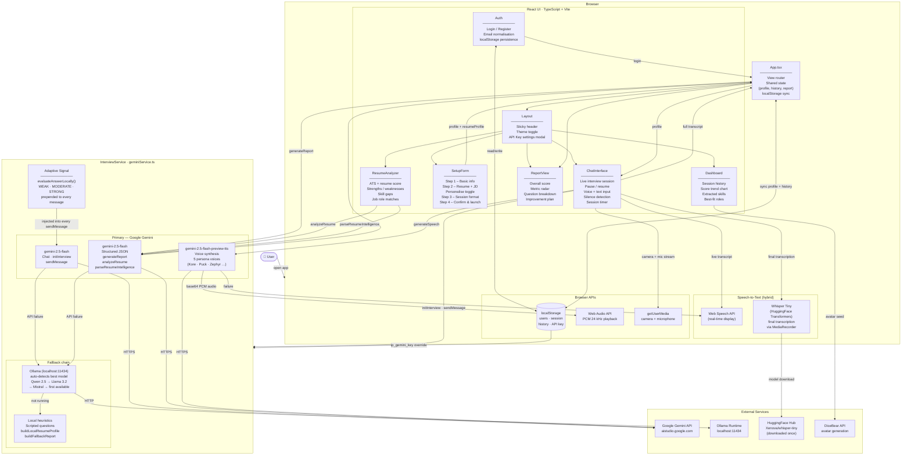

# AI Mock Interviewer — Architecture

## System Overview



---

## Component Responsibility Map

| Component | Owns | Receives from |
|---|---|---|
| **App.tsx** | View state, `profile`, `history`, `report` | Auth (user), Chat (transcript), Setup (profile) |
| **Auth** | Login / register logic | — |
| **Layout** | Theme, API key settings modal | App (theme toggle) |
| **Dashboard** | History list, score chart, skill tags, role matches | App (history, profile) |
| **SetupForm** | Multi-step profile builder, Personalise toggle | App (onStart) |
| **ChatInterface** | Full interview session lifecycle | App (profile, onComplete) |
| **ReportView** | Score display, question breakdown, improvement plan | App (report) |
| **ResumeAnalyzer** | Standalone ATS/job analysis page | App (theme) |

---

## Data Flow — Interview Session

```
User answers question
       │
       ▼
Web Speech API ──► live transcript shown in UI
       │
       ▼
MediaRecorder captures audio blob
       │
       ▼
Whisper Tiny (local) ──► final accurate transcription
       │
       ▼
evaluateAnswerLocally() ──► WEAK / MODERATE / STRONG signal
       │
       ▼
[ADAPTIVE SIGNAL] + answer text ──► Gemini chat (or Ollama)
       │
       ▼
Interviewer reply text
       │
       ▼
Gemini TTS ──► PCM audio ──► Web Audio API playback
(or browser speechSynthesis fallback)
```

---

## Fallback Chain (3 tiers)

```
Gemini API  ──────►  Ollama (localhost)  ──────►  Local heuristics
   (cloud)           (auto-detect model)          (scripted / regex)
   
Interview chat:   Gemini chat  →  Ollama chat (full history)  →  scripted questions
Report:           Gemini JSON  →  Ollama JSON                 →  buildFallbackReport()
Resume analysis:  Gemini JSON  →  Ollama JSON                 →  throws (shown in UI)
Personalise:      Gemini JSON  →  Ollama JSON                 →  buildLocalResumeProfile()
TTS:              Gemini TTS   →  browser speechSynthesis
```

---

## State Persistence (localStorage)

| Key | Contents |
|---|---|
| `ip_users` | Array of `UserAccount` (email, hashed-ish password, profile, history) |
| `ip_session` | Currently logged-in `UserAccount` (auto-login on refresh) |
| `ip_gemini_key` | User-entered Gemini API key (overrides `.env.local`) |

---

## Tech Stack

| Layer | Technology |
|---|---|
| UI framework | React 19 + TypeScript |
| Build tool | Vite 6 |
| Styling | Tailwind CSS (utility-first) |
| Charts | Recharts |
| AI — cloud | Google Gemini 2.5 Flash + TTS Preview (`@google/genai`) |
| AI — local | Ollama (any installed model, auto-detected) |
| STT — realtime | Web Speech API (browser native) |
| STT — accurate | Whisper Tiny via `@huggingface/transformers` (WASM, runs in-browser) |
| Audio output | Web Audio API (PCM decode + playback) |
| Persistence | localStorage (no backend) |
